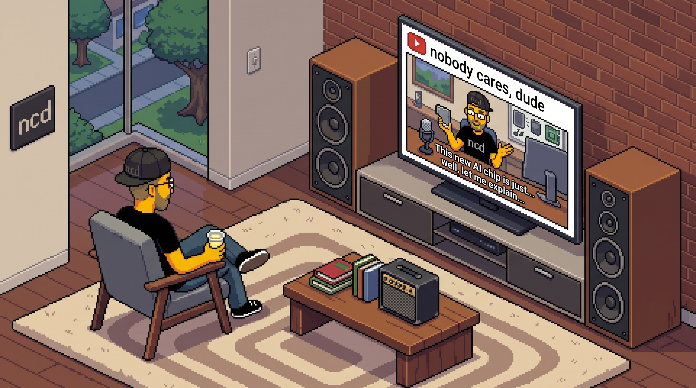

# building a local AI model

This is the companion repository to my [YouTube series]() on low fidelity AI.

low fidelity
: a lower level of detail, realism, or overall quality for a creative work.  

Low fidelity in the sense that we're not looking for perfection.  These are not commercial grade solutions - far from it.  These are experiments in understanding how AI accomplishes some of the magic it does.

I'm taking the stack apart, piece by piece, to get a more clear understanding of exactly what is going on.  

---

Here's a list of what we intend to cover, along with a little indicator of how progress is going.  

- [x] set up Python and a virtual environment
- [x] talk about training data and tokenization
- [x] transformers
- [x] architecture / scaffolding
- [x] training loop / PROBLEM
- [x] cleanup and classification
- [x] testing
- [x] validation (eval framework)
- [ ] quantization / optimization
- [ ] checkpoints
- [ ] early use cases (email, general text stuff)
- [ ] MCP servers

These notes will continue to evolve.